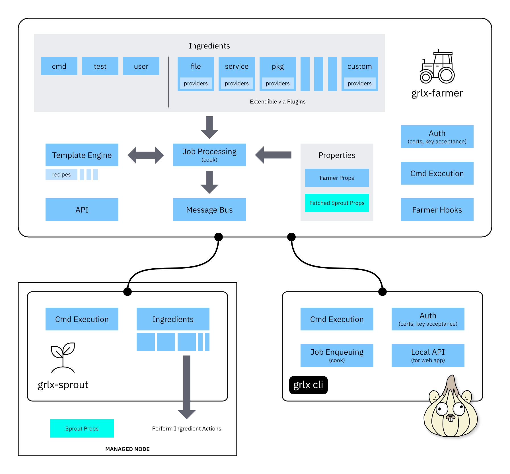

## <p align="center"></p>

# grlx - Effective Fleet Configuration Management

[](https://opensource.org/licenses/0BSD)
[](https://goreportcard.com/report/github.com/gogrlx/grlx) [](https://pkg.go.dev/github.com/gogrlx/grlx)
[](https://github.com/gogrlx/grlx/actions/workflows/codeql-analysis.yml)
[](https://github.com/gogrlx/grlx/actions/workflows/govulncheck.yml)
[](https://github.com/gogrlx/grlx)
[](https://x.com/gogrlx)
[](https://discord.com/invite/VruAThf)


grlx (pronounced like "garlic") is a pure-[Go](http://golang.org) DevOps automation engine designed to use few system resources and keep your application front and center.

## Quick Start
Want to get up and running as quickly as possible to see what all the fuss is about?
Use our bootstrap scripts!

1. Download and initialize the command line utility from our releases to your dev machine.
```bash
# replace 'linux' with darwin if you're on macOS
curl -L https://releases.grlx.dev/linux/amd64/latest/grlx > grlx && chmod +x grlx
./grlx init
```
You'll be asked some questions, such as which interface the `farmer` is listening on, and which ports to use for communication.
Set the interface to the domain name or IP address of the `farmer`.
Once configured, the CLI prints out your administrator public key, which you'll need for the next step!
It's recommended you now add `grlx` somewhere in your `$PATH`.

2. On your control server, you'll need to install the `farmer`.
```bash
# or, just run as root instead of sudo
curl -L https://bootstrap.grlx.dev/latest/farmer | sudo bash
```
You'll be asked several questions about the interface to listen on, which ports to use, etc.
For the quick start, it's recommended to use the default ports (make sure there's no firewall in the way!).
You'll be prompted for an admin public key, which you should have gotten from the prior step, and a certificate host name(s).
Make sure the certificate host name matches the external-facing interface (a domain or IP address) as it will be used for TLS validation!

3. On all of your fleet nodes, you'll need to install the `sprout`.
```bash
# or, just run as root instead of sudo
# FARMER_BUS_PORT and FARMER_API_PORT variables are available in case you chose
# to use different ports.
curl -L https://bootstrap.grlx.dev/latest/sprout | FARMERINTERFACE=localhost sudo -E bash
```
Once the sprout is up and running, return to the CLI.

4. If all is well, you're ready to `cook`! Accept the TLS cert and the `sprout` keys when prompted.
```bash
grlx version
grlx keys accept -A
sleep 15;
grlx -T \* test ping
grlx -T \* cmd run whoami
grlx -T \* cmd run --out json -- uname -a
```

## Why grlx?

Our team started out using competing solutions, and we ran into scalability issues.
Python is a memory hog and is interpreted to boot.
Many systems struggle with installing Python dependencies properly, and with so many moving parts, the probability of something going wrong increases.


## Architecture

grlx is made up of three components: the `farmer`, one or many `sprout`s, and a CLI utility, `grlx`.
The `farmer` binary runs as a daemon on a management server (referred to as the 'farmer'), and is controlled via the `grlx` cli.
`grlx` can be run both locally on the management server or remotely over a secure-by-default, TLS-encrypted API.
The `sprout` binary should be installed as a daemon on systems that are to be managed.
Managed systems are referred to as 'sprouts.'


<p align="center"></p>

## Batteries Included

`farmer` contains an embedded messaging Pub-Sub server ([NATS](https://github.com/nats-io/nats-server)), and an api server.
Nodes running `sprout` subscribe to messages over the bus.
Both the API server and the messaging bus use TLS encryption (elliptic curve by default), and sprouts authenticate using public-key cryptography.

Jobs can be created with the `grlx` command-line interface and typically come in the form of stateful targets called 'recipes'.
Recipes are yaml documents which describe the desired state of a sprout after the recipe is applied (`cook`ed).
Because the `farmer` exposes an API, `grlx` is by no means the only way to create or manage jobs, but it is the only supported method at the beginning.


## Sponsors

A big thank you to all of grlx's sponsors.
If you're a small company or individual user and you'd like to donate to grlx's development, you can donate to individual developers using the GitHub Sponsors button.

For prioritized and commercial support, we have partnered with ADAtomic, Inc., to offer official, on-call hours.
For more information, please [contact the team](mailto:grlx@adatomic.com) via email.

### Founders Club
<p align="left">
    <a href="https://newleafsolutions.dev">
        
    </a>
    <a href="https://github.com/ADAtomic">
        
    </a>
</p>

## Early Adopters

If you or your company use grlx and you'd like to be added to this list, [Create an Issue](https://github.com/gogrlx/grlx/issues/new?assignees=taigrr&labels=docs&projects=&template=add_my_company.md&title=%5BUSER%5D).

<p align="left">
    <a href="https://www.cellpointsystems.com/software-development">
        
    </a>
    <a href="https://dendra.science">
        
    </a>
    <a href="https://newleafsolutions.dev">
        
    </a> 
    <a href="https://google.com">
        
    </a>
    <a href="https://github.com/ADAtomic">
        
    </a>
</p>

## License

Dependencies may carry their own license agreements.
To see the licenses of dependencies, please view [DEPENDENCIES.md](https://github.com/gogrlx/grlx/blob/master/DEPENDENCIES.md).

Unless otherwise noted, the grlx source files are distributed under the 0BSD license found in the [LICENSE](https://github.com/gogrlx/grlx/blob/master/LICENSE) file.

All grlx logos are Copyright 2021 Tai Groot and Licensed under CC BY 3.0.
